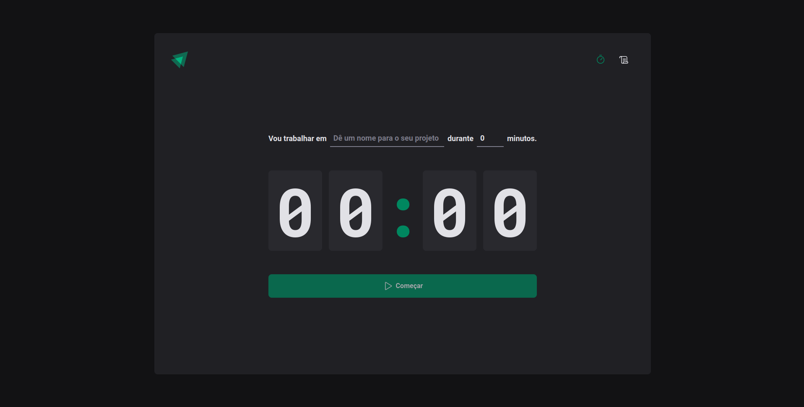
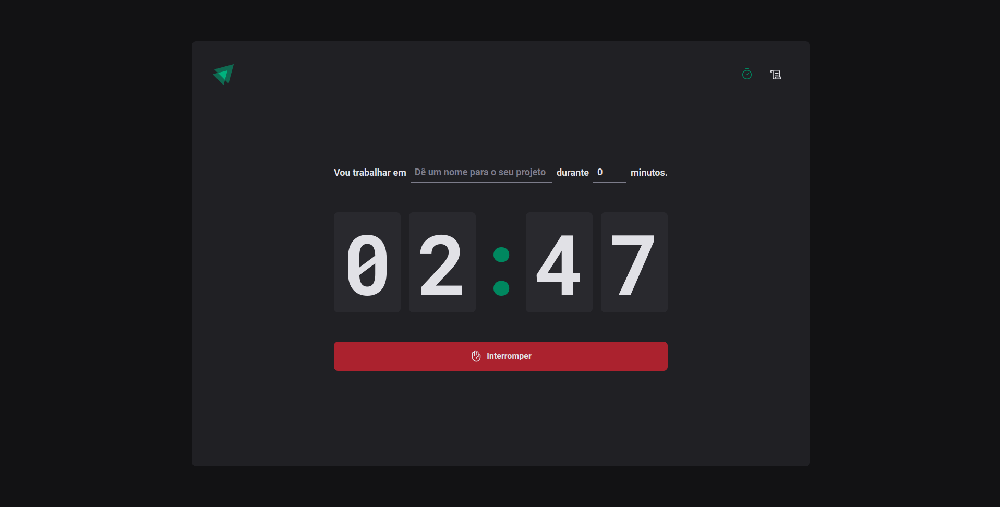
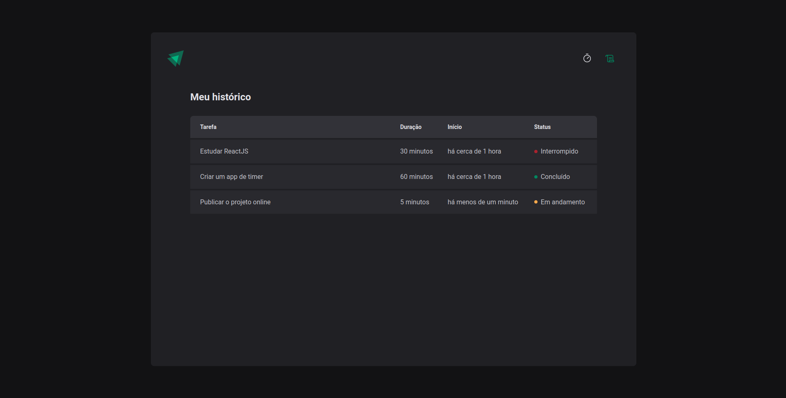

<h3 align="center">Ignite Timer</h3>

  <p align="center">
    Pomodoro style app for time management.
  </p>
</div>

<p align="center">
  
  
  
</p>

<p align="center">
 <a href="#about-the-project">About The Project</a> •
 <a href="#built-with">Built With</a> • 
 <a href="#prerequisites">Prerequisites</a> • 
 <a href="#installation">Installation</a> • 
 <a href="#features">Features</a> • 
 <a href="#license">License</a> •
 <a href="#author">Author</a>
</p>


## About The Project

<h3 align="center">Home</h3>
<h2 align="center">
    
</h2>

<h2 align="center">
    
</h2>

<h3 align="center">History</h3>
<h2 align="center">
    
</h2>


### Built With

* [![React][React.js]][React-url]
* [![Typescript][Typescript]][Typescript-url]
* [![StyledComponents][StyledComponents]][StyledComponents-url]
* [![ReactHookForm][ReactHookForm]][ReactHookForm-url]
* [![Immer][Immer]][Immer-url]
* [![NPM][NPM]][NPM-url]
* [![Vite][Vite]][Vite-url]


### Prerequisites

You will need Node.js and NPM installed on your machine to run the project.


### Installation

1. Clone the repo:
   ```sh
   git clone https://github.com/raiffsaid/challenge01-ignite2022-reactjs.git
   ```
2. Install project dependencies:
   ```sh
   npm install
   ```
3. In project root folder, run:
   ```sh
   npm run dev
   ```


## Features

- [x] Create named cycles 
- [x] Interrupt cycles
- [x] History of created cycles and its status (In Progress, Interrupted and Finished)
- [x] Persisted data with localStorage


## License

Distributed under the MIT License. See [LICENSE][license] for more information.


## 


## Author

 

 <sub><b>Raiff Said</b></sub>

 Get in contact:

[][linkedin-url] 
[][email]


<!-- MARKDOWN LINKS & IMAGES -->
<!-- https://www.markdownguide.org/basic-syntax/#reference-style-links -->
[linkedin-url]: https://linkedin.com/in/raiffsaid
[email]: mailto:raiff.said@gmail.com

[license]: https://github.com/raiffsaid/ignite-timer/blob/main/LICENSE.md

[React.js]: https://img.shields.io/badge/ReactJS-20232A?style=for-the-badge&logo=react&logoColor=61DAFB
[React-url]: https://reactjs.org/

[Vite]: https://img.shields.io/badge/-vite-20232A?style=for-the-badge&logo=vite&logoColor=646CFF
[Vite-url]: https://vitejs.dev/

[Typescript]: https://img.shields.io/badge/Typescript-20232A?style=for-the-badge&logo=typescript&logoColor=3178C6
[Typescript-url]: https://www.typescriptlang.org/

[NPM]: https://img.shields.io/badge/Npm-20232A?style=for-the-badge&logo=npm&logoColor=CB3837
[NPM-url]: https://www.npmjs.com/

[License-Badge]: https://img.shields.io/github/license/raiffsaid/challenge01-ignite2022-reactjs?style=flat-square

[Immer]: https://img.shields.io/badge/Immer-20232A?style=for-the-badge&logo=immer&logoColor=00E7C3
[Immer-url]: https://github.com/immerjs/immer


[StyledComponents]: https://img.shields.io/badge/Styled_components-20232A?style=for-the-badge&logo=styled%20components&logoColor=DB7093
[StyledComponents-url]: https://styled-components.com/

[ReactHookForm]: https://img.shields.io/badge/React_Hook_Form-20232A?style=for-the-badge&logo=react%20hook%20form&logoColor=EC5990
[ReactHookForm-url]: https://react-hook-form.com/